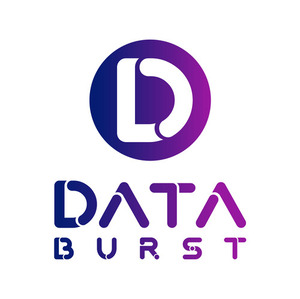

# Databurst Data Engineering Wiki

Welcome to the official wiki of DataBurst, your comprehensive resource for all things related to data engineering. Our team, comprised of dedicated data engineering professionals, is committed to providing you with the latest insights, best practices, and detailed discussions that span the breadth of data engineering and our innovative products.

This wiki serves as a central hub for:

- **The Data Engineering Roadmap:** A detailed guide tailored for both newcomers and seasoned experts. Dive into each topic for a deeper understanding and practical applications.
- **DataBurst Products and Services:** Explore how our solutions can transform your data operations and business intelligence.
- **Community Contributions and Collaborations:** Engage with our content, suggest improvements, and share your insights. Your participation is crucial to the evolution of our resources.

We encourage you to visit our [GitHub community](https://github.com/data-burst) to contribute to our projects, explore our [official website](https://databurst.tech/) to learn more about our services, and connect with us on [Linkedin](https://www.linkedin.com/company/databurst/) to stay updated on company news and job opportunities. For real-time discussions and support, join our vibrant [Discord community](https://discord.com/invite/DWVD3gVv).

Dive into our wiki, explore the vast array of topics, and join us in shaping the future of data engineering. Let’s harness the power of data together with DataBurst!