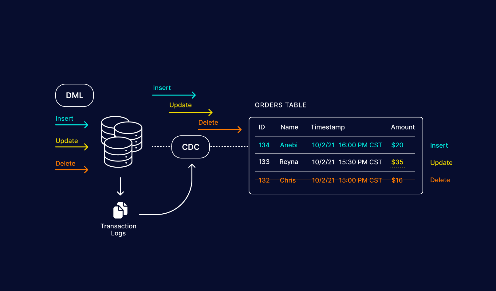

# CDC

## Introduction

CDC (Change Data Capture) is a data management technique used to identify and track changes (inserts, updates, deletes) in data over time within a database or a data source. By capturing only the changes, rather than the entire data set, CDC makes the process of data replication, synchronization, and integration more efficient, especially for applications like data warehousing, ETL processes, and real-time analytics.

### How CDC Works
**1. Capture:** CDC monitors a source database for changes. Different methods can be used to capture changes, such as transaction log scanning, triggers, or timestamps.
**2. Record:** Once changes are detected, CDC records them in a staging area or a log table. This record includes the type of change (insert, update, or delete) and the specific data fields that were affected.
**3. Process:** The recorded changes are processed and transformed according to the needs of the target system or application. This might involve filtering, mapping, or other forms of transformation.
**4. Deliver:** Finally, the processed changes are delivered to the target system, which could be a data warehouse, another database, or a message queue for further processing.

### Methods of CDC Implementation
- **Log-Based CDC:** Reads the transaction logs (write-ahead logs) of the source database. It's efficient because it captures changes directly from the log and has minimal impact on the primary database.
- **Trigger-Based CDC:** Utilizes database triggers to capture changes. Triggers automatically log changes to a separate table when data is modified.
- **Timestamp-Based CDC:** Compares timestamp fields to identify new or modified records since the last extraction. It is simple but requires careful management of timestamps.
- **Manual/Custom CDC:** Involves writing custom logic in the application layer to capture changes. This can offer flexibility but is less standardized.
  
### Use Cases
- **Data Warehousing:** CDC enables periodic updates to the data warehouse by only processing and transferring incremental changes, which reduces the load and processing time.
- Replication and Synchronization: CDC helps in replicating and synchronizing data across multiple databases, keeping them consistent.
- **Real-Time Analytics:** CDC provides near-real-time data for analytics by streaming updates to analytical platforms, helping businesses make data-driven decisions faster.
- **ETL Optimization:** By integrating CDC with ETL processes, data transformations can be faster and more efficient, since only new or changed data is processed.

### Popular CDC Tools
- **Debezium:** An open-source platform that provides log-based CDC for databases like MySQL, PostgreSQL, and MongoDB.
- **Oracle GoldenGate:** A comprehensive CDC and data replication tool for Oracle databases.
- **AWS DMS:** AWS Data Migration Service provides CDC capabilities for cloud migrations.
- **Talend:** Offers CDC features as part of its data integration suite.

CDC is crucial in data management strategies that require timely and accurate data updates. By focusing on capturing changes rather than entire datasets, CDC optimizes data transfer and helps organizations build efficient and scalable data processing architectures.

## Learning Resources

### Books
- [Streaming Change Data Capture (Chapter 1. Why Use Change Data Capture?)](https://www.oreilly.com/library/view/streaming-change-data/9781492032526/)
- [Change Data Capture A Complete Guide - 2020 Edition](https://www.amazon.com/Change-Data-Capture-Complete-Guide/dp/1867403692)

### Courses
- [Change Data Capture (CDC) Explained (with examples)](https://www.youtube.com/watch?v=5KN_feUhtTM)
- [What Is Change Data Capture - Understanding Data Engineering 101](https://www.youtube.com/watch?v=hNJCxF3IWC4)
- [What is Change Data Capture?](https://www.youtube.com/watch?v=1PuP-z1T-Cs)
- [Change Data Capture + Event Driven Architecture](https://www.youtube.com/watch?v=ARWNnnDGPag)
- [Data Pipelines: Using CDC to Ingest Data into Kafka](https://www.youtube.com/watch?v=T6PAcWtoHTo)

### Miscellaneous
- [What is change data capture (CDC)?](https://www.redhat.com/en/topics/integration/what-is-change-data-capture)
- [What is Change Data Capture?](https://medium.com/@andrew.macconnell/using-change-data-capture-9548ff7b41e3)
- [Change Data Capture (CDC): What it is and How it Works](https://www.striim.com/blog/change-data-capture-cdc-what-it-is-and-how-it-works/)
- [Why Change Data Capture?](https://www.confluent.io/learn/change-data-capture/)
- [Change Data Capture](https://www.qlik.com/us/change-data-capture/cdc-change-data-capture)