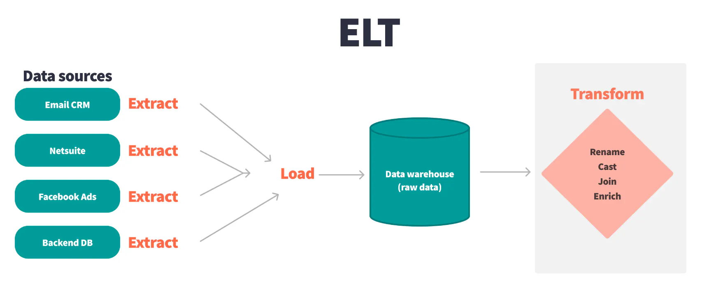

# ELT

## Introduction

ELT (Extract, Load, Transform) is a modern approach to data integration that differs from the traditional ETL (Extract, Transform, Load) methodology, primarily in the sequence of operations. In the ELT approach, the data is first extracted from the source systems and then loaded directly into the target system, typically a data warehouse, without prior transformation. The transformation step happens after the data has been loaded into the data warehouse. This method leverages the power and scalability of modern data warehouse technology to process large volumes of data efficiently.

**1. Extract:** Data is extracted from various source systems, which can include relational databases, NoSQL databases, file-based data stores, and cloud-based data storage solutions.
**2. Load:** The extracted data is loaded into a target data warehouse or data lake. Unlike ETL, the data is loaded in its raw form without any transformations. This process is generally faster because it involves less initial processing.
**3. Transform:** Once the data is loaded into the data warehouse, transformation processes are applied directly within the database. Modern data warehouses and data lakes are powerful enough to handle complex queries and data transformations efficiently on large datasets.

### Differences Between ELT and ETL

**1. Process Order:**

   - **ETL:** Data is extracted, transformed into a suitable format or structure for querying and analysis, and then loaded into the target database or data warehouse.
   - **ELT:** Data is extracted, loaded directly into the target system in its raw state, and then transformed within the target   system.
  
**2. Data Transformation:**

- **ETL:** Transformations are performed before the data reaches the target system, typically using an intermediate staging area and transformation tools.
- **ELT:** Transformations are performed after the data is loaded, utilizing the processing power of the target system which often results in more dynamic and flexible manipulation of the data.
  
**3. Performance & Scalability:**
- **ETL:** Can be less efficient with large data volumes due to the need to transform data before loading, which can be time-consuming and resource-intensive.
- **ELT:** Better suited for handling large volumes of data as it leverages the robust processing capabilities of advanced data warehouses like Google BigQuery, Amazon Redshift, and Snowflake.

**4. Flexibility:**
- **ETL:** Requires predefined transformation logic before the data loading, which can be less flexible if business needs change frequently.
- **ELT:** Offers greater flexibility as raw data is loaded directly, and transformations can be adjusted more easily without reprocessing the entire data pipeline.

### Use Cases
ELT is particularly advantageous in scenarios involving:

- **Big Data Processing:** Where the sheer volume of data makes traditional ETL impractical due to processing constraints.
Real-Time Data Analytics: ELT allows for quicker availability of data in the target system, enabling more agile analytics and business intelligence operations.
Cloud Computing: Cloud-native data warehouses provide scalable resources for processing and storing vast amounts of data, making them ideal for ELT processes.
ETL, on the other hand, might still be preferable for:

- **Complex Data Transformations:** Where data needs extensive cleansing and transformation that are best handled outside of the data warehouse to not impede the performance of the warehouse.
Legacy Systems: Where integration with older data storage technologies that may not efficiently support in-database transformations.
Conclusion
Choosing between ELT and ETL depends largely on the specific data needs of an organization, the nature of the source data, the capabilities of the target system, and the required flexibility of the data processing workflows. As cloud technologies continue to evolve, ELT is becoming a more compelling option for many organizations due to its scalability and efficiency in processing large datasets.

## Learning Resources

### Courses
- [ETL vs ELT Explained Clearly!!](https://www.youtube.com/watch?v=i06_budXBl0)
- [ETL vs ELT | Modern Data Architectures](https://www.youtube.com/watch?v=_Nk0v9qUWk4)
- [ETL vs ELT](https://www.youtube.com/watch?v=IF5YrYiV0sA) 

### Miscellaneous
- [What is ELT?](https://www.ibm.com/topics/elt)
- [Extract, Load, Transform (ELT)](https://www.techtarget.com/searchdatamanagement/definition/Extract-Load-Transform-ELT)
- [What is ELT? Understanding the difference between ELT and ETL](https://www.stitchdata.com/resources/what-is-elt/)
- [How ELT Works](https://www.qlik.com/us/elt)
- [ETL vs ELT: 5 Critical Differences](https://www.integrate.io/blog/etl-vs-elt/)