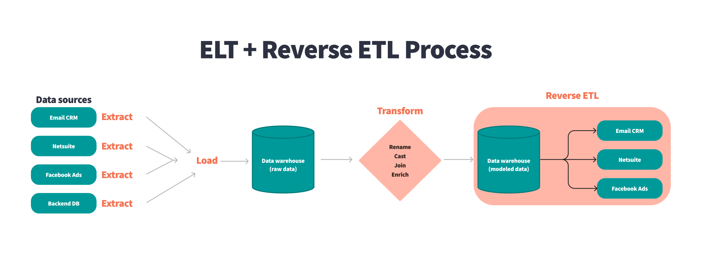

# Reverse ETL

## Introduction
Reverse ETL is a relatively new data integration concept that involves extracting data from a centralized data warehouse or data lake, transforming it into a suitable format, and loading it into external operational tools like customer relationship management (CRM) systems, marketing platforms, or analytics tools. The goal is to make the valuable insights stored in data warehouses actionable for non-technical teams like marketing, sales, and customer support.

### Key Components of Reverse ETL
**1. Extract:** Data is extracted from a data warehouse, data lake, or other central storage where information is aggregated. This data typically comes from multiple sources via regular ETL processes or other data integration techniques.
**2. Transform:** The extracted data is transformed into a format that is compatible with external systems or applications. This may involve converting data types, normalizing structures, or filtering irrelevant information.
**3. Load:** Transformed data is then loaded into the target external system, which could be a CRM, marketing automation platform, customer support tool, or other operational software.

### Benefits of Reverse ETL
**1. Improved Data Accessibility:** It brings data out of centralized storage and makes it accessible directly in the tools that frontline teams use daily, helping them make more informed decisions.
**2. Operational Efficiency:** With data accessible in familiar tools, teams can streamline workflows by reducing the need to manually fetch, export, or input data.
**3. Personalization:** Customer-facing teams can use detailed data to improve personalization in marketing campaigns, customer support interactions, and product recommendations.
**4. Consistent Metrics:** By sourcing data directly from a single warehouse, reverse ETL ensures consistent KPIs and metrics across different business functions.

### Use Cases
- **Marketing:** Enrich marketing automation platforms with detailed customer attributes and engagement data to create highly targeted campaigns.
- **Sales:** Provide sales teams with up-to-date customer information, including engagement history, purchase intent scores, and recent support tickets.
- **Customer Support:** Integrate customer support tools with relevant data to deliver better customer service, identify high-value customers, and prioritize tickets effectively.
- **Product Management:** Allow product teams to integrate product usage data into their roadmaps, identifying which features are being used or overlooked.

### Reverse ETL Tools
- **Census:** A platform focused on syncing data from warehouses to CRM, marketing, and analytics tools.
- **Hightouch:** Enables seamless data synchronization from your warehouse to marketing, sales, and customer success tools.
- **RudderStack:** Offers Reverse ETL capabilities alongside its customer data platform.
- **Fivetran:** Primarily known for its data connectors, Fivetran also offers some Reverse ETL features.

### Reverse ETL vs. Traditional ETL
- **Direction of Data Flow:**
    - **Traditional ETL:** Moves data from various source systems into a centralized data warehouse or lake for analysis.
    - **Reverse ETL:** Moves data from the data warehouse or lake into operational systems to make data accessible and useful to end-users.
- **Purpose:**
    - **Traditional ETL:** Centralizes data for analytics, reporting, and machine learning.
    - **Reverse ETL:** Uses the centralized data to provide insights back to business systems, enabling data-driven decision-making directly within operational tools.

Reverse ETL bridges the gap between data analysis and actionable insight by providing teams with the right data at the right time in the right tools, thereby making centralized data warehouses more valuable across the organization.

## Learning Resources

### Books
- [Fundamentals of Data Engineering (Chapter 9. Serving Data for Analytics, Machine Learning, and Reverse ETL)](https://www.oreilly.com/library/view/fundamentals-of-data/9781098108298/)

### Courses
- [Reverse ETL Explained](https://www.youtube.com/watch?v=RaSgOFVRb04)
- [What is Reverse ETL?](https://www.youtube.com/watch?v=DRAGfc5or2Y)
- [What is Reverse ETL? (Explained by the Creator)](https://www.youtube.com/watch?v=G_aq03cSa8Y)
- [What Is A Reverse ETL - And Why Is The Modern Data Stack Obsessed With It?](https://www.youtube.com/watch?v=pkoSi8DjTl4)

## Articles
- [Reverse ETL for Improved Scalability, Observability, and Performance of Modern Operational Analytics -A Comparative Review](https://www.researchgate.net/publication/368816467_Reverse_ETL_for_Improved_Scalability_Observability_and_Performance_of_Modern_Operational_Analytics_-A_Comparative_Review)

### Miscellaneous
- [Closing the loop: Reverse ETL](https://www.talend.com/resources/reverse-etl/#:~:text=A%20reverse%20ETL%20tool%20extracts,modeling%20in%20their%20preferred%20applications.)
- [What is Reverse ETL? The Definitive Guide](https://hightouch.com/blog/reverse-etl)
- [What is Reverse ETL? Complete Guide](https://rivery.io/blog/what-is-reverse-etl-guide-for-data-teams/)
- [What is reverse ETL? A complete guide](https://segment.com/blog/reverse-etl/)
- [All you need to know about Reverse ETL](https://www.dinmo.com/reverse-etl/)