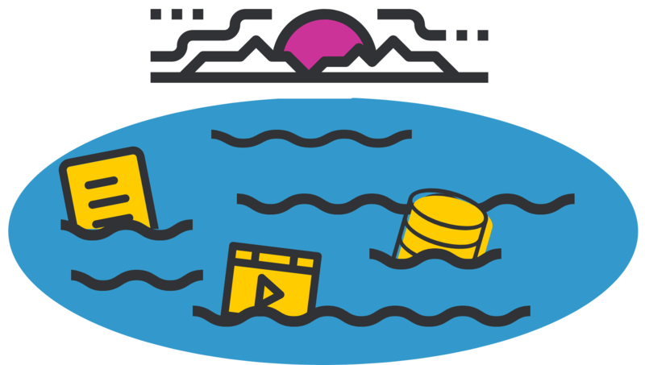

# Data Lake

## Introduction
A Data Lake is a vast, centralized repository that allows organizations to store large volumes of raw, unstructured, semi-structured, and structured data from a wide range of sources. Unlike traditional databases or data warehouses, a data lake does not impose a rigid schema on the data, offering more flexibility in terms of how data is ingested and stored.

A data lake is built to store **data in its raw form**. This means that data is ingested as-is, without any transformation or preprocessing. It can handle all types of data, such as:

- **Structured data**: Tabular data found in relational databases, spreadsheets, and other structured formats.
- **Semi-structured data**: Data like JSON, XML, and CSV files that don’t fit neatly into tables but have some level of organization.
- **Unstructured data**: Data like text documents, images, videos, and social media posts that lack a predefined structure.
This flexibility allows data lakes to accommodate a wide variety of use cases, from simple log storage to complex big data analytics.

### Differences Between a Data Lake and a Data Warehouse
While a data lake and a data warehouse both store large volumes of data, they have distinct differences:

- **Schema**: A data warehouse enforces a predefined schema, which means data must be transformed before being loaded. A data lake, on the other hand, stores data in its original format and applies schema-on-read, meaning the schema is applied when the data is queried.
- **Data Processing**: Data warehouses use ETL (Extract, Transform, Load) processes to ensure that only clean, structured data enters the warehouse. Data lakes use ELT (Extract, Load, Transform), allowing raw data to be stored first and then transformed as needed.
- **Use Cases**: Data warehouses are optimized for BI tools, reporting, and structured analytics, while data lakes are designed to accommodate broader analytical applications, including machine learning, big data processing, and AI.

### Architecture of a Data Lake
A data lake is typically built on distributed storage systems like Hadoop Distributed File System (HDFS) or cloud-based object storage like Amazon S3, Microsoft Azure Data Lake, or Google Cloud Storage. These systems are designed to scale easily and cost-effectively, handling petabytes of data across thousands of servers.

- **Data Ingestion**: A data lake ingests data from multiple sources, including databases, IoT devices, logs, social media platforms, and APIs. Data is ingested in various formats—whether it be streaming, batch processing, or real-time data. Tools like Apache Kafka, Flume, and AWS Kinesis are often used for this.

- **Storage**: Once ingested, the data is stored in its raw format across distributed systems. Object storage allows the data lake to handle diverse types of data efficiently and ensures high availability and fault tolerance.

- **Data Cataloging**: To make sense of the massive amount of raw data in a lake, a data catalog or metadata management system is necessary. Tools like Apache Atlas or AWS Glue catalog data assets, ensuring that users can locate and access the right datasets for analysis. This metadata helps define what data is stored and how it can be queried.

- **Data Processing**: Data in the lake can be processed using various big data processing frameworks like Apache Spark, Hadoop, or Presto. These frameworks allow organizations to process and transform raw data for specific use cases, such as data analytics, machine learning model training, or real-time decision-making.

- **Access and Analytics**: Data lakes are designed to support both batch processing and real-time analytics. They can serve as a backend for data science, enabling tasks like predictive modeling, natural language processing, and other machine learning workflows. Popular tools for accessing and analyzing data in lakes include Apache Hive, Impala, and Jupyter Notebooks.

### Benefits of a Data Lake

- **Scalability**: Data lakes are highly scalable due to the use of distributed storage systems. They can grow as needed without major changes to architecture, making them ideal for storing massive datasets.

- **Flexibility**: Since data lakes can store any type of data in any format, they provide immense flexibility. They support all forms of data—from text, audio, and video to real-time sensor data—without requiring a rigid schema.

- **Cost-Effectiveness**: Cloud-based data lakes, in particular, are cost-effective because they use cheap object storage. Unlike traditional databases, they do not require expensive compute resources for day-to-day operations unless the data is actively being processed or queried.

- **Support for Advanced Analytics**: Data lakes are often used in conjunction with advanced analytics, such as machine learning (ML) and artificial intelligence (AI). By storing vast amounts of raw data, data scientists and engineers can build predictive models and conduct exploratory analysis without having to transform the data beforehand.

- **Multiple Access Patterns**: Users can access data lakes using a wide range of interfaces—SQL queries, programming languages like Python and R, or big data processing frameworks. This makes it accessible to both data scientists and analysts.

### Challenges of a Data Lake
Despite the benefits, data lakes come with challenges:

1. Data Governance and Security: Managing data access, ensuring compliance, and maintaining data privacy in a data lake can be complex due to the diverse and large-scale nature of the data. Organizations must ensure proper governance through role-based access control (RBAC), encryption, and auditing.

Data Quality: Storing raw data means that not all of it may be clean or useful. Without proper data quality checks, a data lake can turn into a "data swamp," where the data becomes difficult to manage, access, or analyze effectively.

Query Performance: Querying large datasets in a data lake can be slower compared to a structured data warehouse. Schema-on-read means that queries must handle large, unprocessed datasets, which can affect performance unless optimizations like partitioning and indexing are applied.

Complexity in Use: Data lakes often require advanced skills and tools to manage and process the data. Engineers need to implement robust workflows and processing pipelines to ensure data is usable for analysis.

Use Cases of Data Lakes
Machine Learning and AI: Data lakes allow organizations to store all their raw data—structured and unstructured—enabling data scientists to train machine learning models using vast datasets.

Big Data Analytics: Organizations use data lakes for processing large volumes of logs, streaming data, and transactional data for real-time analytics and business intelligence.

IoT Data Storage: Data lakes are ideal for storing sensor data from IoT devices, which is typically unstructured and continuous. This data can then be analyzed for predictive maintenance, monitoring, and optimization.

Data Archiving: Data lakes are also useful for long-term storage of historical data, where data is not frequently accessed but may be needed for compliance, auditing, or future analytics.

A Data Lake is a versatile, scalable, and cost-effective solution for organizations dealing with massive amounts of data. Its ability to store all types of data without enforcing a schema upfront makes it ideal for modern analytical applications like machine learning and big data processing. However, to fully realize its potential, proper data governance, cataloging, and processing frameworks must be in place. When used correctly, a data lake becomes a powerful engine for insights, enabling organizations to derive value from their data at an unprecedented scale.

## Learning Resources

### Books
- [The Enterprise Big Data Lake](https://www.oreilly.com/library/view/architecting-data-lakes/9781492033004/)
- [Architecting Data Lakes, 2nd Edition](https://www.oreilly.com/library/view/architecting-data-lakes/9781492033004/)

### Courses
- [What is a Data Lake?](https://www.youtube.com/watch?v=LxcH6z8TFpI&pp=ygUJZGF0YSBsYWtl)
- [Data Lake vs Data Warehouse](https://www.youtube.com/watch?v=AwbKwcw7bgg&pp=ygUJZGF0YSBsYWtl)
- [Data Lake Architecture](https://www.youtube.com/watch?v=1x0uJzMd1Pg&pp=ygUJZGF0YSBsYWtl)

### Miscellaneous
- [What is a Data Lake? (Google)](https://cloud.google.com/learn/what-is-a-data-lake)
- [What is a Data Lake? (Amazon)](https://aws.amazon.com/what-is/data-lake/)
- [What is a Data Lake? (Microsoft)](https://azure.microsoft.com/en-gb/resources/cloud-computing-dictionary/what-is-a-data-lake)
- [Introduction to Data Lakes (Databricks)](https://www.databricks.com/discover/data-lakes)
- [What is a Data Lake?](https://www.oracle.com/uk/big-data/data-lake/what-is-data-lake/)
- [What is a Data Lake? (OCI)](https://www.oracle.com/uk/big-data/data-lake/what-is-data-lake/)
- [What is a Data Lake? (Qlik)](https://www.qlik.com/us/data-lake)
- [What is a Data Lake? (Snowflake)](https://www.snowflake.com/guides/what-data-lake/)

