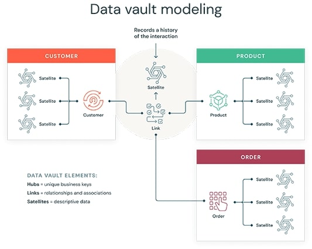

# Data Vault

## Introduction

The Data Vault modeling approach is a hybrid that features aspects of both the third normal form (3NF) and star schema. It is designed for large-scale data warehouses and aims to provide long-term historical storage of data coming from multiple operational systems, making it highly flexible and scalable.

### Characteristics:

- **Robustness:** Highly adaptable to changes in the environment, making it suitable for enterprises where change is constant.
- **Complexity:** Consists of three types of tables: Hubs (key business concepts), Links (associations between hubs), and Satellites (descriptive attributes and historical versions).
- **Scalability and Flexibility:** Excellent scalability and the ability to integrate disparate systems over time without requiring significant redesign.

## Learning Resources

### Books
- [Modeling the Agile Data Warehouse with Data Vault](https://www.amazon.com/Modeling-Agile-Data-Warehouse-Vault-ebook/dp/B00ITWTCF0)
- [Building a Scalable Data Warehouse with Data Vault 2.0](https://www.oreilly.com/library/view/building-a-scalable/9780128026489/)

### Courses
- [Data Vault vs Traditional Data Warehouse Architectures](https://www.youtube.com/watch?v=D914nNWGP6E)
- [What is a Data Vault ? | 3NF vs Dimensional model vs Data Vault | Quick Starter Guide in 2023](https://www.youtube.com/watch?v=l5UcUEt1IzM)
- [Comparing 3 Types of Data Modeling (Normalized vs Star Schema vs Data Vault) ](https://www.youtube.com/watch?v=qXXNhLv986I)
- [A brief introduction to Data Vault 2.0 - Part 1 of 7 - Introduction](https://www.youtube.com/watch?v=wEhDvjN7f0I&list=PLPz42gh12w04u1VKr4R5Cwbg3EvD1aZdC)
- [How to create a Data Vault Model from scratch](https://www.youtube.com/watch?v=KgW4YVZYpQk)
- [Understand the Data Vault Architecture](https://www.youtube.com/watch?v=O5P8I56NXjc)

### Miscellaneous
- [What is a data vault?](https://www.databricks.com/glossary/data-vault)
- [Practical Introduction to Data Vault Modeling](https://medium.com/@nuhad.shaabani/practical-introduction-to-data-vault-modeling-1c7fdf5b9014)