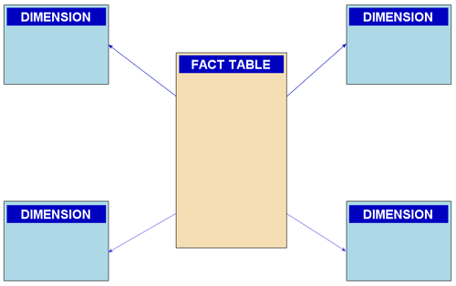

# Star Schema (Ralph Kimbal)

## Introduction

The Star Schema is a traditional database schema with a central table known as the fact table surrounded by dimension tables, which form a star-like shape. This schema is optimized for querying large data sets and is commonly used in business intelligence and reporting applications.

### Characteristics:

- **Simplicity:** Easy to understand and navigate, with clear relationships between the central fact table (which contains measurable, quantitative data) and dimension tables (which describe attributes related to the data).
- **Performance:** Efficient for read queries due to the denormalized structure, which reduces the number of joins necessary when performing queries.
- **Query Optimization:** Ideal for OLAP systems where query speed is crucial, as it allows for fast aggregation and summarization.

## Learning Resources

### Books
- [Star Schema The Complete Reference](https://www.oreilly.com/library/view/star-schema-the/9780071744324/)

### Courses
- [What is STAR schema | Star vs Snowflake Schema | Fact vs Dimension Table](https://www.youtube.com/watch?v=hQvCOBv_-LE)
- [Data Modeling Tutorial: Star Schema (aka Kimball Approach)](https://www.youtube.com/watch?v=gRE3E7VUzRU)
- [Data Warehouse - Star Schema](https://www.youtube.com/watch?v=-q9xuDGGpzQ)
- [Basic Star Schema design](https://www.youtube.com/watch?v=q77B-G8CA24)

### Miscellaneous
- [What is a star schema?](https://www.databricks.com/glossary/star-schema)
- [Star Schema in Data Warehouse modeling](https://www.geeksforgeeks.org/star-schema-in-data-warehouse-modeling/)