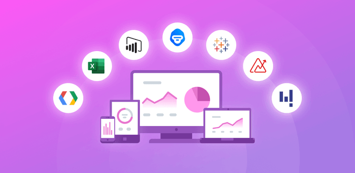

# Data Visualization

## Introduction
Data visualization is a critical aspect of data analysis and business intelligence, enabling users to understand complex data through graphical representation. Effective data visualization helps uncover trends, patterns, and insights that can drive informed decision-making. Below, we discuss four popular data visualization tools: Power BI, Metabase, Superset, and Tableau, highlighting their key features and use cases.

### Power BI
Power BI is a business analytics tool developed by Microsoft, designed to deliver interactive visualizations and business intelligence capabilities with a user-friendly interface. It integrates with a wide range of data sources, allowing users to create detailed reports and dashboards.

**Key Features:**
- **Interactive Dashboards**: Create dynamic and interactive dashboards that allow users to drill down into details.
- **Data Connectivity**: Supports a wide array of data sources, including SQL databases, Excel, cloud services, and more.
- **Natural Language Queries**: Users can ask questions in natural language to get insights from their data.
- **Real-Time Analytics**: Offers real-time data visualization capabilities, making it suitable for monitoring live data.
- **Collaboration and Sharing**: Facilitates collaboration by allowing users to share dashboards and reports within their organization.

**Use Cases:**
- Business reporting and performance tracking
- Data exploration and ad-hoc analysis
- Real-time monitoring of key performance indicators (KPIs)

### Metabase
Metabase is an open-source business intelligence tool that simplifies the process of querying databases and visualizing data. It is known for its ease of use and quick setup, making it accessible to users with minimal technical expertise.

**Key Features:**
- **Simple Interface**: User-friendly interface with a focus on simplicity and ease of use.
- **Query Builder**: Allows users to create complex queries without writing SQL, using a visual query builder.
- **Embedded Analytics**: Provides the ability to embed dashboards and visualizations into web applications.
- **Open Source**: Being open source, it allows for customization and flexibility based on organizational needs.
- **Automated Reporting**: Supports scheduling and automated delivery of reports.

**Use Cases:**
- Quick data exploration and dashboard creation
- Embedding analytics in web applications
- Automated reporting and alerting

### Superset
Apache Superset is an open-source data exploration and visualization platform that offers a wide range of visualization options and robust integration with various data sources. It is designed to be scalable and extensible, making it suitable for large organizations.

**Key Features:**
- **Extensive Visualization Options**: Offers a wide variety of charts and visualizations to choose from.
- **SQL Lab**: A SQL IDE that allows users to write and execute SQL queries against their databases.
- **Customizable Dashboards**: Users can create and customize dashboards with drag-and-drop functionality.
- **Authentication and Security**: Integrates with enterprise authentication systems for secure access.
- **Scalability**: Designed to scale with the data needs of large organizations.

**Use Cases:**
- Data exploration and interactive visualization
- Dashboard creation for business intelligence
- Large-scale data analysis in enterprise environments

### Tableau
Tableau is a leading data visualization tool known for its powerful analytics and interactive visualizations. It provides an intuitive interface for users to create and share interactive dashboards and reports.

**Key Features:**
- **Interactive Visualizations**: Create highly interactive and visually appealing charts and dashboards.
- **Data Blending**: Combine data from multiple sources into a single view for comprehensive analysis.
- **Drag-and-Drop Interface**: Easy-to-use drag-and-drop interface for creating visualizations without coding.
- **Advanced Analytics**: Supports advanced analytics features like forecasting, trend analysis, and statistical summaries.
- **Collaboration**: Enables collaboration through Tableau Server or Tableau Online, allowing teams to share and collaborate on dashboards.

**Use Cases:**
- Business intelligence and performance analysis
- Data storytelling and presentation
- Ad-hoc analysis and data exploration

Data visualization tools like Power BI, Metabase, Superset, and Tableau each offer unique capabilities to meet diverse business needs. Power BI is ideal for users seeking integration with Microsoft products and real-time analytics. Metabase caters to those looking for a simple, open-source solution for quick data exploration. Superset is suitable for organizations requiring scalability and extensive customization options. Tableau stands out with its advanced analytics and highly interactive visualizations, making it a preferred choice for comprehensive data storytelling and business intelligence. The selection of a tool depends on specific requirements, existing infrastructure, and the level of technical expertise available within the organization.

## Learning resources

### Books
- [Fundamentals of Data Visualization](https://www.oreilly.com/library/view/fundamentals-of-data/9781492031079/)
- [data visualization](https://www.techtarget.com/searchbusinessanalytics/definition/data-visualization)

### Courses
- [Data Visualization Tutorial For Beginners | Big Data Analytics Tutorial | Simplilearn](https://www.youtube.com/watch?v=MiiANxRHSv4)

### Miscellaneous
- [What Is Data Visualization? Definition, Examples, And Learning Resources](https://www.tableau.com/learn/articles/data-visualization#:~:text=Data%20visualization%20is%20the%20graphical,outliers%2C%20and%20patterns%20in%20data.)