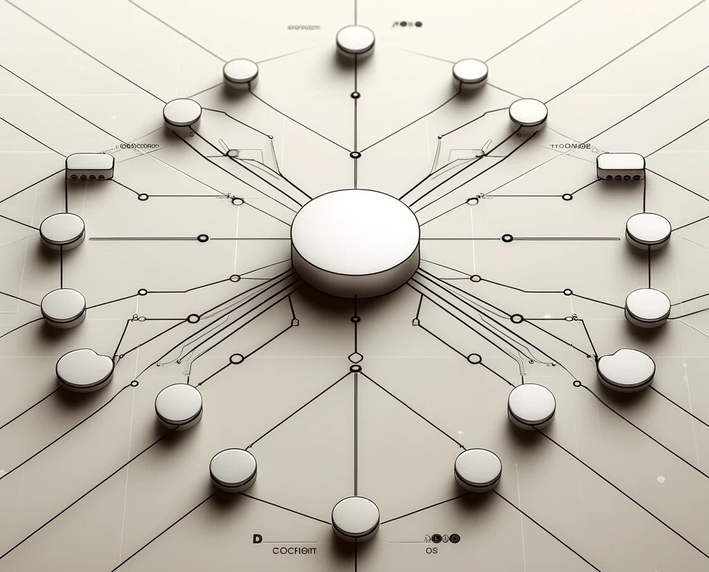

# Distributed Systems

## Introduction

A distributed system is a network of independent computers that appear to the user as a single coherent system. This setup allows for the sharing of resources and capabilities, enabling higher levels of performance, reliability, and scalability than might be possible with a single computer.

The main goal of distributed systems is to coordinate the process and manage data among multiple computers to improve efficiency and performance. Examples include cloud computing platforms, distributed databases, and real-time data processing systems. The complexity in distributed systems arises from the need to handle issues like data consistency, fault tolerance, and communication across diverse and sometimes unreliable networks.

    

## Learning Resources

### Books
- ["Distributed Systems" by Andrew S. Tanenbaum and Maarten van Steen](https://www.distributed-systems.net/index.php/books/ds4/)
- ["Designing Data-Intensive Applications" by Martin Kleppmann](https://www.oreilly.com/library/view/designing-data-intensive-applications/9781491903063/)

### Courses
- [MIT 6.824 Distributed Systems (Spring 2020)](https://www.youtube.com/watch?v=cQP8WApzIQQ&list=PLrw6a1wE39_tb2fErI4-WkMbsvGQk9_UB)
- [Distributed Systems lecture series](https://www.youtube.com/playlist?list=PLeKd45zvjcDFUEv_ohr_HdUFe97RItdiB)

