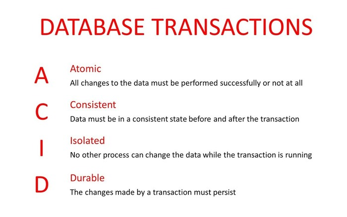
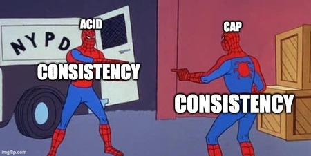

# ACID

## Introduction

To maintain consistency in a database, before and after a transaction, ACID properties are required. ACID stands for **A**tomicy, **C**onsistency, **I**solation and **D**urability:

- **Atomicy** – Guarantees that each transaction is accurately executed. If not, the process will stop and the database will revert back to its previous state. This prevents data corruption or loss to the dataset.
- **Consistency** – A processed transaction will never endanger the structural integrity of the database. Ensures that a processed transaction does not affect the validity of the database, by only allowing updates according to established rules and policies.
- **Isolation** – Transactions cannot compromise the integrity of other transactions by interacting with them while they are still in progress.
- **Durability** – committed transactions will remain committed even upon system failures

When applying ACID properties to transactions, it guarantees that each read, write, update or delete operation possesses the ACID attributes.

When choosing the right ACID schema it is important to take into account not only the functional requirements but also the database capabilities. Certain implementations might be very expensive as they require some database records locking. Locking can be performed on different database layers, perhaps just a row, or in some cases the whole table may be locked, so that update operations block all reads and writes. This can add latency to the total operation time and may consume a significant amount of memory.

### Consistency in ACID vs Consistency in CAP

Consistency in the context of CAP means that all nodes store and provide the same data. For ACID, consistency means that internal rules within an individual node must apply across the board.

For example, that all values in a column must be unique.

## Learning Resources

### Books

- [Database and Transaction Processing](https://www.amazon.com/Database-Transaction-Processing-Philip-Lewis/dp/0201708728)

### Courses

- [ACID Properties in Databases With Examples](https://www.youtube.com/watch?v=GAe5oB742dw)

### Miscellaneous

- [ACID Transactions: The Cornerstone of Database Integrity](https://www.yugabyte.com/acid/acid-transactions/)
- [How to Achieve ACID Compliance on Distributed, Highly Available Systems](https://www.gigaspaces.com/blog/acid-distributed-transactions#:~:text=ACID%20stands%20for%20Atomicy%2C%20Consistency,or%20loss%20to%20the%20dataset.)
- [CAP vs ACID | What's the difference?](https://budibase.com/blog/data/cap-vs-acid/#:~:text=To%20reiterate%2C%20consistency%20in%20the,a%20column%20must%20be%20unique.)
- [The confusing CONSISTENCY in CAP and ACID](https://www.linkedin.com/pulse/confusing-consistency-cap-acid-pranav-pandey/)
