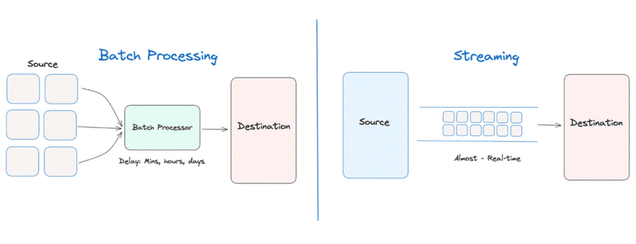

# Batch and Stream Processing

## Introduction

In distributed systems, data processing tasks are often categorized into two types: batch processing and stream processing. Both paradigms have distinct characteristics and are suited to different types of data processing needs. Understanding the differences between them can help in selecting the appropriate approach for a given requirement.

### Batch Processing

Batch processing involves processing large volumes of data in groups or "batches". Data is collected over a period and processed in a single, large job. This method is not real-time and is designed for scenarios where it is acceptable to have some delay between data collection and obtaining results.

- **High Throughput:** Optimized to process large volumes of data efficiently.
- **Latency:** There is inherent latency from the time data is collected until it is processed, as the system waits for a full batch.
- **Complex Computations:** Well-suited for complex, long-running processes that require access to all the data at once.
- **Resource Optimization:** Can make better use of system resources by processing large blocks of data together.

### Stream Processing

Stream processing, in contrast, handles data in real-time as it flows in. This method is designed for tasks that require immediate processing and fast response times. Data is processed sequentially and incrementally, often without the need to store the entire dataset.

- **Low Latency:** Processes data with minimal delay, providing results in real-time or near-real-time.
- **Continuity:** Data is processed continuously rather than in discrete batches.
- **Scalability:** Designed to scale out across multiple nodes, handling high throughput and large data streams.
- **Fault Tolerance:** Typically includes mechanisms to handle failures and ensure data integrity in a continuous processing environment.

### Choosing Between Batch and Stream Processing

The choice between batch and stream processing depends on the specific requirements of the application, including factors like:

- **Data Volume:** Batch processing might be more appropriate for lower velocity data or when it's feasible to wait for the complete dataset to accumulate.
- **Response Time:** Stream processing is necessary when the application demands immediate processing and quick response times.
- **Complexity of Analysis:** Complex analyses that don’t require real-time decision-making might be more efficiently handled in batch mode.

Many modern applications combine both processing types, using stream processing for real-time monitoring and alerting, and batch processing for deep analytics and reporting on historical data. This hybrid approach leverages the strengths of both processing methods to meet diverse data handling and analysis needs in distributed systems.

## Learning Resources

### Books
- [Streaming Systems](https://www.oreilly.com/library/view/streaming-systems/9781491983867/)
- [Fundamentals of Data Engineering](https://www.oreilly.com/library/view/fundamentals-of-data/9781098108298/)
- ["Designing Data-Intensive Applications" by Martin Kleppmann](https://www.oreilly.com/library/view/designing-data-intensive-applications/9781491903063/)
- [Introduction to Apache Flink (Chapter 6)](https://www.oreilly.com/library/view/introduction-to-apache/9781491977132/)

### Courses
- [Batch Processing vs Stream Processing | System Design Primer | Tech Primers](https://www.youtube.com/watch?v=A3Mvy8WMk04)
- [What is Stream Processing? | Batch vs Stream Processing | Data Pipelines | Real-Time Data Processing](https://www.youtube.com/watch?v=ya4298V8Mqo)

### Miscellaneous
- [Difference between Batch Processing and Stream Processing](https://www.geeksforgeeks.org/difference-between-batch-processing-and-stream-processing/)
- [Batch Processing vs Stream Processing: 7 Key Differences](https://atlan.com/batch-processing-vs-stream-processing/)
- [Real-Time Vs. Batch Processing Vs. Stream Processing](https://www.harperdb.io/post/real-time-vs-batch-processing-vs-stream-processing)