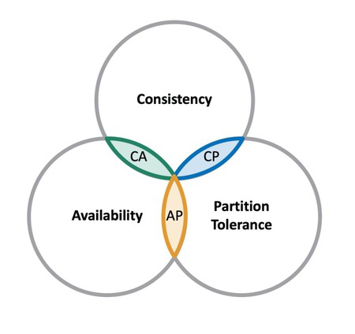

# CAP

## Introduction

The CAP theorem is a fundamental principle that applies to distributed data systems, stating that it is impossible for a distributed system to simultaneously provide more than two out of the following three guarantees:

- **Consistency**
Consistency means that all clients see the same data at the same time, no matter which node they connect to. For this to happen, whenever data is written to one node, it must be instantly forwarded or replicated to all the other nodes in the system before the write is deemed ‘successful.’

- **Availability**
Availability means that any client making a request for data gets a response, even if one or more nodes are down. Another way to state this—all working nodes in the distributed system return a valid response for any request, without exception.

- **Partition tolerance**
A partition is a communications break within a distributed system—a lost or temporarily delayed connection between two nodes. Partition tolerance means that the cluster must continue to work despite any number of communication breakdowns between nodes in the system.

## Learning Resources

### Books
- ["Distributed Systems" by Andrew S. Tanenbaum and Maarten van Steen](https://www.distributed-systems.net/index.php/books/ds4/)
- ["Designing Data-Intensive Applications" by Martin Kleppmann](https://www.oreilly.com/library/view/designing-data-intensive-applications/9781491903063/)

### Courses
- [CAP Theorem Simplified](https://www.youtube.com/watch?v=BHqjEjzAicA)
