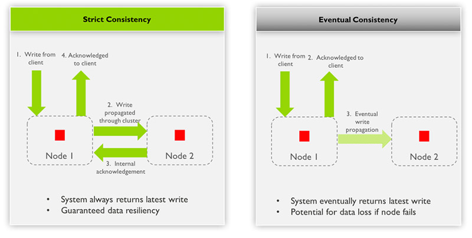

# Consistency vs Eventual Consistency

## Introduction

In distributed systems, consistency and eventual consistency are two different approaches to maintaining data integrity across multiple nodes or replicas.

- **Consistency** refers to the state where all replicas or nodes in a distributed system have the same data at any given time. When a data update occurs, it is immediately propagated to all nodes, ensuring that they all reflect the latest changes. This approach guarantees that clients will always read the most up-to-date data, regardless of which node they access.

- **Eventual Consistency**, on the other hand, is a more relaxed model where updates are propagated asynchronously to replicas or nodes. This means that after an update, there may be a period of time during which different nodes have different versions of the data. However, the system is designed to eventually converge, reaching a consistent state where all nodes have the latest data. Eventual consistency trades off immediate consistency for improved system performance, availability, and partition tolerance.

The choice between consistency and eventual consistency depends on the specific requirements of the application. Consistency is preferred in scenarios where data integrity is critical, such as financial transactions or systems that cannot tolerate any inconsistencies. Eventual consistency is often used in large-scale distributed systems, such as web applications, where the trade-off between availability and strict consistency is acceptable, and the system can handle temporary inconsistencies.

## Learning Resources

### Books
- [Principles of Eventual Consistency (Foundations and Trends(r) in Programming Languages)](https://www.amazon.com/Principles-Consistency-Foundations-Programming-Languages/dp/1601988583)
- [Building an Event-Driven Data Mesh (Chapter 10)](https://www.oreilly.com/library/view/building-an-event-driven/9781098127596/)

### Courses
- [Data Consistency | Strong Consistency vs. Eventual Consistency | System Design for Beginners](https://www.youtube.com/watch?v=WZqGS-wczaY)
- [What is Eventual Consistency? | System Design](https://www.youtube.com/watch?v=rpqsSkTIdAw)
- [Distributed Systems 7.3: Eventual consistency](https://www.youtube.com/watch?v=9uCP3qHNbWw)
- [Eventual consistency vs Strong consistency (with Example)](https://www.youtube.com/watch?v=Qz9DiHng-RM)

### Miscellaneous
- [Eventual Consistency vs. Strong Eventual Consistency vs. Strong Consistency](https://www.baeldung.com/cs/eventual-consistency-vs-strong-eventual-consistency-vs-strong-consistency)
- [Eventual consistency in distributed systems | Learn system design](https://www.geeksforgeeks.org/eventual-consistency-in-distributive-systems-learn-system-design/)
- [What is the difference between Weak Consistency and Eventual Consistency?](https://www.designgurus.io/answers/detail/difference-between-weak-consistency-vs-eventual-consistency)