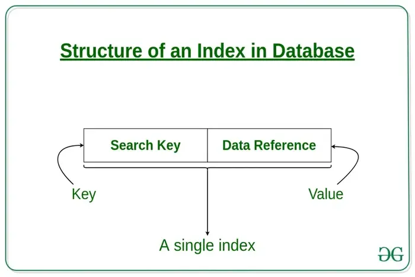

# Indexing

## Introduction

Indexing in distributed systems is a crucial mechanism designed to optimize the retrieval of data across multiple nodes, ensuring quick access to records without scanning entire datasets. As data is spread across different servers or nodes in a distributed environment, efficient indexing strategies are vital to achieving high performance, especially in large-scale systems where data volumes and access patterns can be extensive and varied.

1. **Distributed Indexing:** Instead of maintaining a single, central index, distributed systems often employ multiple indices, each residing on different nodes. This setup allows the system to parallelize query processing, reducing the load on individual nodes and improving response times.
2. **Partitioned Indexes:** In systems where data is partitioned across nodes (sharding), indexes are typically partitioned correspondingly. Each shard will have its own local index for the data it stores. Queries that can be satisfied by data within a single shard can be handled locally, enhancing performance.
3. **Global Indexes:** Some distributed systems also maintain a global index that can route queries to the appropriate shards. While maintaining global indexes can increase complexity and overhead, they can significantly speed up query processing by reducing the number of nodes involved in each query.
4. **Replicated Indexes:** For critical or frequently accessed data, indexes may be replicated across several nodes to enhance fault tolerance and reduce latency, as multiple copies ensure that the failure of a single node does not lead to a loss of indexing capability.

### Challenges of Indexing in Distributed Systems:

- **Consistency:** Keeping indices consistent across nodes is challenging, especially when updates, inserts, and deletions are frequent. Consistency mechanisms can introduce overhead and complicate system design.
- **Scalability:** As the volume of data and the number of nodes increase, scaling the indexes without degrading performance becomes challenging.
- **Complexity of Query Processing:** Queries that need to access multiple indices across different nodes require sophisticated query planning and execution strategies to minimize cross-node traffic and optimize response times.
- **Balancing Load:** Uneven distribution of data can lead to uneven distribution of queries, which may overload certain nodes. Effective load balancing strategies are essential to prevent bottlenecks.
  
### Use Cases:

- **Search Engines:** Distributed indexing is fundamental in search engines, which must index and search large datasets across many servers.
- **Distributed Databases:** Both SQL and NoSQL distributed databases rely on efficient indexing to ensure quick query responses.
- **Big Data Platforms:** Systems like Hadoop use indexing techniques to improve the performance of large-scale data processing tasks.
  

Effective indexing strategies are critical in distributed systems to ensure they meet the performance and scalability requirements necessary for modern, data-intensive applications. The choice of indexing technique can significantly affect both the performance of data queries and the overall system architecture.

## Learning Resources

### Books

- [Query-Driven Indexing in Large-Scale Distributed Systems: Efficient query processing with distributed indexes](https://www.amazon.com/Query-Driven-Indexing-Large-Scale-Distributed-Systems/dp/3639150171)

### Courses
- [How indexes work in Distributed Databases, their trade-offs, and challenges](https://www.youtube.com/watch?v=eQ3eNd5WbH8)

### Miscellaneous
- [Indexing in Databases – Set 1](https://www.geeksforgeeks.org/indexing-in-databases-set-1/)