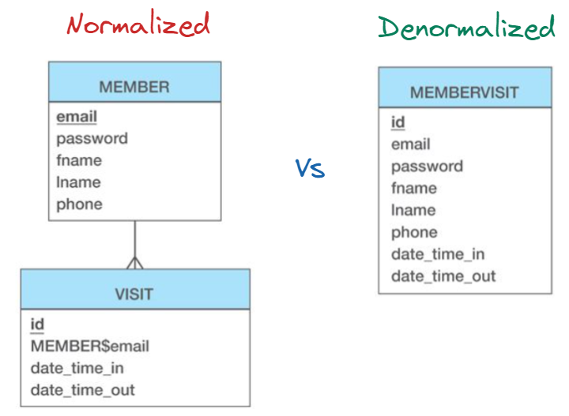

# Normalization or Denormalization

## Introduction

Normalization and denormalization are concepts related to database design, and they have implications in distributed systems as well.

- **Normalization:**
    Normalization is the process of organizing data in a database to reduce redundancy and minimize data anomalies (such as update, insertion, and deletion anomalies). It involves breaking down data into smaller tables and defining relationships between them. Normalization aims to eliminate redundant data and ensure data integrity.

    In distributed systems, normalization can be beneficial because it reduces the amount of data that needs to be replicated across nodes, which can improve performance and reduce storage requirements. However, normalized data often requires joining multiple tables to retrieve related information, which can lead to increased complexity and overhead, especially in distributed environments.

- **Denormalization:**
    Denormalization is the process of introducing redundant data or combining related data into a single table or entity. It is essentially the opposite of normalization. Denormalization is typically done to improve query performance by reducing the need for expensive join operations and simplifying data access.

    In distributed systems, denormalization can be advantageous because it allows data to be accessed more efficiently from a single node or replica, reducing the need for cross-node communication and coordination. This can improve read performance, especially in scenarios where data is accessed frequently. However, denormalization can increase storage requirements and make updates more complex, as redundant data needs to be maintained consistently across multiple nodes.

The decision to normalize or denormalize data in a distributed system depends on various factors, such as the nature of the data, read and write patterns, performance requirements, and the trade-offs between data integrity, storage, and query efficiency. In many cases, a combination of normalization and denormalization techniques is employed, striking a balance between data integrity, performance, and scalability requirements.

## Learning Resources

### Courses
- [DP 900 — Normalized vs Denormalized Data](https://www.youtube.com/watch?v=vRqzFBTgGJA)
- [Data Normalization vs Denormalization - Which is better when ?](https://www.youtube.com/watch?v=W_5vn8TBLys)

### Miscellaneous
- [Cracking the Data Modeling Interview: Part 2: Normalization, Indexes and Partitioning](https://medium.com/@seancoyne/cracking-the-data-modeling-interview-part-2-normalization-indexes-and-partitioning-fac334d767ca)
- [Normalization and Denormalization in the aspect of Data Engineering.](https://linkedin.com/pulse/normalization-denormalization-aspect-data-engineering-patro/)
- [Database Normalization vs. Denormalization](https://medium.com/analytics-vidhya/database-normalization-vs-denormalization-a42d211dd891)