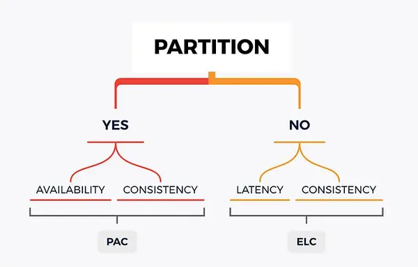

# PACELC

## Introduction

The PACELC theorem is an extension to the CAP theorem. Both theorems were developed to provide a framework for comparing distributed systems. Like the CAP theorem, the PACELC theorem states that in case of network partitioning (P) in a distributed computer system, one has to choose between availability (A) and consistency (C). PACELC extends the CAP theorem by introducing latency and consistency as additional attributes of distributed systems. The theorem states that, "else (E), even when the system is running normally in the absence of partitions, one has to choose between latency (L) and consistency (C)."

PACELC was developed to address a key limitation of the CAP theorem: it makes no provision for performance or latency. For example, according to the CAP theorem, a database can be considered Available if a query returns a response after 30 days. Obviously, such latency would be unacceptable for any real-world application.

## Learning Resources

### Books
- ["Designing Data-Intensive Applications" by Martin Kleppmann](https://www.oreilly.com/library/view/designing-data-intensive-applications/9781491903063/)

### Courses
- [Latency and Consistency Tradeoffs in Modern Distributed Databases](https://www.scylladb.com/glossary/pacelc-theorem/#:~:text=Learn%20about%20PACELC%20vs%20CAP%20theorem)
- [CAP Theorem & PACELC in Distributed System | System Design Interview Concept | CAP Theorem Explained](https://www.youtube.com/watch?v=BaKtC-VIYrM)
- [CAP Theorem And PACELC | 10 Min System Design](https://www.youtube.com/watch?v=zeMHZWp6QYo)

