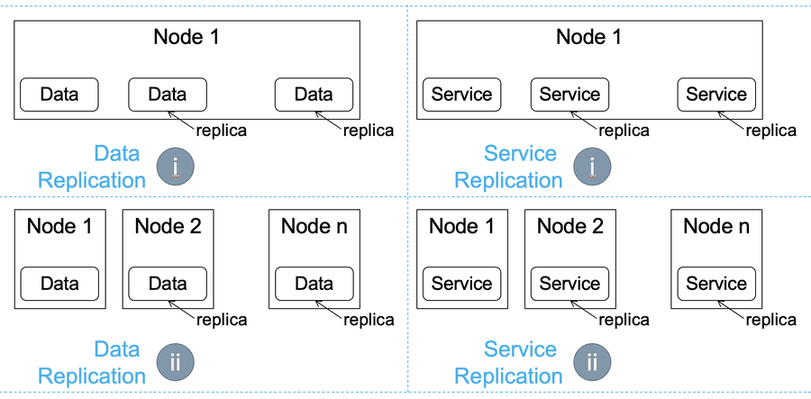

# Replication

## Introduction

Replication in distributed systems is a fundamental strategy used to ensure data availability, durability, and fault tolerance. It involves maintaining copies of data on multiple machines (replicas) to prevent data loss in case of hardware failure or other issues. Replication can be implemented in various ways, depending on the specific requirements for consistency, performance, and fault tolerance of the system.

Like resource sharing, replication can occur (i) in time, where multiple replicas (instances) co-exist on the same machine (node), simultaneously, or (ii) in space, where multiple instances exist on multiple machines. Figure 1 illustrates how data or services could be replicated in time or in space. For example, data replication in space (Figure 1, bottom-left quadrant) places copies of the data from Node 1 on several other nodes, here, Node 2 through n. As another example, service replication in time (Figure 1, top-right quadrant) launches copies of the service on the same node, Node 1.

### Replicated Service vs Sharded Service

With the replicated services, each replica was entirely homogeneous and capable of serving every request. In contrast to replicated services, with sharded services, each replica, or shard, is only capable of serving a subset of all requests. A load-balancing node, or root, is responsible for examining each request and distributing each request to the appropriate shard or shards for processing. The contrast between replicated and sharded services is represented in

Replicated services are generally used for building stateless services, whereas sharded services are generally used for building stateful services. The primary reason for sharding the data is because the size of the state is too large to be served by a single machine. Sharding enables you to scale a service in response to the size of the state that needs to be served.

## Learning Resources

### Courses
- [Sharding | Horizontal Scaling | System Design Interview Basics](https://www.youtube.com/watch?v=0DzRdQ-sOTg)
- [Distributed Systems 5.1: Replication](https://www.youtube.com/watch?v=mBUCF1WGI_I)
- [Database Replication Explained (in 5 Minutes)](https://www.youtube.com/watch?v=bI8Ry6GhMSE)

### Miscellaneous
- [What is Replication in Distributed System?](https://www.geeksforgeeks.org/what-is-replication-in-distributed-system/)
- [Data Replication in Distributed Systems: The Best Guide 101](https://hevodata.com/learn/data-replication-in-distributed-system/#:~:text=Replication%3A%20Distributed%20systems%20allow%20sharing,as%20software%20and%20hardware%20components.)