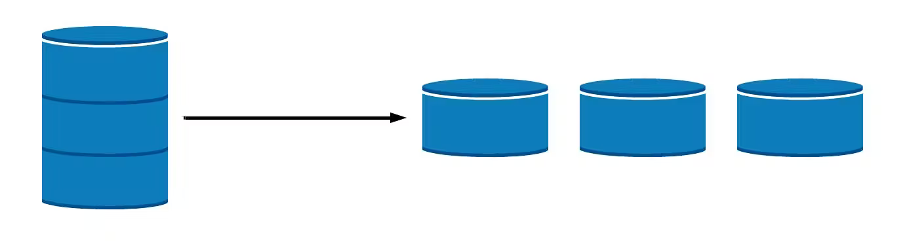
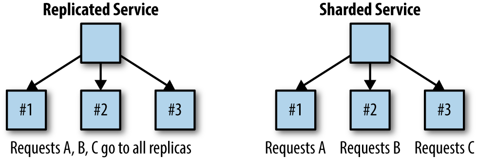

# Sharding

## Introduction

Sharding is a method for distributing a single dataset across multiple databases, which can then be stored on multiple machines. This allows for larger datasets to be split into smaller chunks and stored in multiple data nodes, increasing the total storage capacity of the system. See more on the basics of sharding here.

Similarly, by distributing the data across multiple machines, a sharded database can handle more requests than a single machine can.

Sharding is a form of scaling known as horizontal scaling or scale-out, as additional nodes are brought on to share the load. Horizontal scaling allows for near-limitless scalability to handle big data and intense workloads. In contrast, vertical scaling refers to increasing the power of a single machine or single server through a more powerful CPU, increased RAM, or increased storage capacity.

### Replicated Service vs Sharded Service

With the replicated services, each replica was entirely homogeneous and capable of serving every request. In contrast to replicated services, with sharded services, each replica, or shard, is only capable of serving a subset of all requests. A load-balancing node, or root, is responsible for examining each request and distributing each request to the appropriate shard or shards for processing. The contrast between replicated and sharded services is represented in

Replicated services are generally used for building stateless services, whereas sharded services are generally used for building stateful services. The primary reason for sharding the data is because the size of the state is too large to be served by a single machine. Sharding enables you to scale a service in response to the size of the state that needs to be served.

## Learning Resources

### Books
- [Designing Distributed Systems](https://www.oreilly.com/library/view/designing-distributed-systems/9781491983638/)

### Courses
- [What is DATABASE SHARDING?](https://www.youtube.com/watch?v=5faMjKuB9bc)
- [Sharding | Horizontal Scaling | System Design Interview Basics](https://www.youtube.com/watch?v=0DzRdQ-sOTg)
- [The Basics of Database Sharding and Partitioning in System Design](https://www.youtube.com/watch?v=be6PLMKKSto)

### Miscellaneous
- [Understanding Database Sharding](https://www.digitalocean.com/community/tutorials/understanding-database-sharding)
- [Sharding in Distributed Systems](https://medium.com/whiteblock/sharding-in-distributed-systems-29ba2f7f135b)
