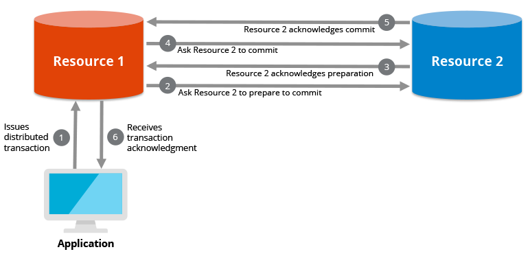
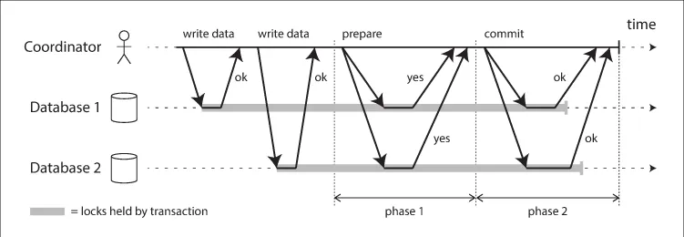

# Transaction

## Introduction

A distributed transaction is defined as a group of operations that are to be performed across more than one database or data repository. The operations are performed by multiple nodes that are connected to a single network. The distributed transaction ensures ACID (Atomicity, Consistency, Isolation, Durability) properties and data integrity.

Transactions in distributed systems refer to a series of operations performed across multiple nodes that need to be executed in a coherent and reliable manner. Ensuring that a transaction either completely succeeds or fails as a whole, especially in a distributed environment, is more complex than in a centralized system. This complexity arises from the challenges of coordinating multiple nodes, dealing with potential network failures, and maintaining data consistency across disparate systems

### Technologies and Protocols:
- **Two-Phase Commit (2PC):** This protocol ensures all nodes either commit or roll back changes made during a transaction. It involves a coordinator (or transaction manager) and can be a bottleneck and a single point of failure.

    

- **Three-Phase Commit (3PC):** An improvement over 2PC, it adds an additional phase to reduce the likelihood of blocking and is more fault-tolerant.
- **Distributed Databases:** Systems like Google's Spanner use globally synchronized clocks (TrueTime) to manage transactions across the globe with high consistency and minimal latency.
- **NoSQL and Eventually Consistent Systems:** Systems like Apache Cassandra or Amazon DynamoDB use eventual consistency models that allow for higher performance and availability at the cost of immediate consistency.

Managing transactions in distributed systems involves balancing requirements for consistency, availability, and partition tolerance, often leading to innovative solutions that are tailored to specific application needs or operational environments. These systems strive to minimize the complexity visible to end-users while dealing with the inherent complexities of distributed data management internally.

## Learning Resources

### Books
- [Distributed Systems An Algorithm Approach (Chapter 14)](https://www.oreilly.com/library/view/distributed-systems-2nd/9781466552975/)
- [Database Internals (Chapter 13)](https://www.oreilly.com/library/view/database-internals/9781492040330/)

### Courses
- [20. Handle Distributed Transactions | Two-Phase Commit (2PC), Three-Phase Commit (3PC), SAGA Pattern](https://www.youtube.com/watch?v=ET_DnJgfplY)
- [Distributed Systems 7.1: Two-phase commit](https://www.youtube.com/watch?v=-_rdWB9hN1c)
- [Do you know Distributed transactions?](https://www.youtube.com/watch?v=S4FnmSeRpAY)
- [distributed transaction | requirements| Distributed systems | Lec-60 | Bhanu Priya](https://www.youtube.com/watch?v=Atn7NMgaRbw)
- [Lecture 12: Distributed Transactions](https://www.youtube.com/watch?v=aDp99WDIM_4)

### Miscellaneous
- [What is a Distributed Transaction?](https://www.geeksforgeeks.org/what-is-a-distributed-transaction/)
- [What is a Distributed Transaction?](https://hazelcast.com/glossary/distributed-transaction/)