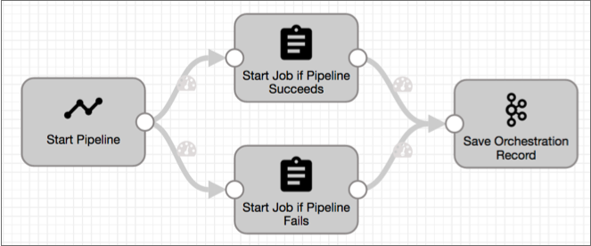

# Pipeline Orchestration

## Introduction
Pipeline orchestration is a crucial aspect of data engineering, involving the coordination and management of data workflows to ensure seamless and efficient processing. A data pipeline refers to a series of steps where data is collected, processed, and transferred from one system to another. Orchestration ensures these steps are executed in the correct sequence, handling dependencies, scheduling, error handling, and resource management.

In a data engineering context, orchestration helps automate the workflow processes, allowing data engineers to build, manage, and monitor complex data pipelines. This automation reduces manual intervention, minimizes errors, and enhances the overall efficiency and reliability of data workflows. Key features of pipeline orchestration tools include:

1. **Scheduling**: Automating the execution of data workflows at specified times or intervals.
2. **Dependency Management**: Ensuring that tasks are executed in the correct order, based on their dependencies.
3. **Error Handling**: Automatically managing and alerting on errors, allowing for retries or alternative workflows.
4. **Monitoring and Logging**: Providing visibility into workflow execution, performance metrics, and logging for debugging purposes.
5. **Scalability**: Handling the increasing volume and complexity of data workflows as organizations grow.

### Tools for Pipeline Orchestration
Several tools are available for pipeline orchestration in data engineering, each with its own strengths and use cases. Below, we discuss some popular tools, with a particular focus on Apache Airflow due to its widespread adoption and robust feature set.

### Apache Airflow
Apache Airflow is an open-source platform to programmatically author, schedule, and monitor workflows. It is highly extensible and widely used in the data engineering community due to its flexibility and scalability. Key features of Apache Airflow include:

- **Directed Acyclic Graphs (DAGs)**: Airflow uses DAGs to represent workflows, allowing for clear visualization of task dependencies.
- **Extensible**: Supports custom plugins and integrations, making it adaptable to various use cases and environments.
- **Scheduling**: Robust scheduling capabilities to automate the execution of workflows.
- **Web Interface**: A user-friendly web UI for monitoring and managing workflows.
- **Community and Ecosystem**: A large and active community, providing extensive documentation, plugins, and support.

### Mage
Mage is a relatively new entrant in the data orchestration space, offering a modern approach to building and managing data pipelines. It focuses on simplicity and ease of use, making it accessible to both data engineers and analysts. Key features of Mage include:

- **Visual Interface**: Drag-and-drop interface for building and managing workflows.
- **Integration**: Built-in integrations with popular data sources and destinations.
- **Collaboration**: Designed for collaborative data pipeline development.
- **Automation**: Automates repetitive tasks and handles dependency management.

### Argo
Argo is an open-source container-native workflow engine for orchestrating parallel jobs on Kubernetes. It is particularly well-suited for machine learning, data processing, and CI/CD pipelines. Key features of Argo include:

- **Kubernetes-Native**: Seamless integration with Kubernetes, leveraging its scalability and resilience.
- **Parallel Execution**: Efficiently manages and executes parallel tasks.
- **Custom Resources**: Uses Kubernetes custom resources to define and manage workflows.
- **Scalability**: Highly scalable, suitable for large and complex workflows.

### Prefect
Prefect is a modern workflow orchestration tool designed to address the limitations of traditional solutions. It focuses on making orchestration easier and more reliable. Key features of Prefect include:

- **Pythonic API**: Easy-to-use API for defining and managing workflows using Python.
- **Fault Tolerance**: Advanced error handling and retry logic.
- **Dynamic Workflows**: Supports dynamic and parameterized workflows.
- **Cloud or Self-Hosted**: Offers both cloud-managed and self-hosted options.

### Dagster
Dagster is an open-source orchestration platform designed for the development, production, and observation of data assets. It emphasizes the development and testing of data workflows. Key features of Dagster include:

- **Type-Safe Pipelines**: Enforces data types throughout the pipeline to catch errors early.
- **Asset-Based Approach**: Focuses on data assets and their transformations.
- **Integrated Testing**: Built-in support for testing workflows.
- **Flexible Deployment**: Can be deployed on various environments, including Kubernetes and Docker.

Pipeline orchestration is a fundamental aspect of modern data engineering, enabling the automation and management of complex data workflows. Tools like Apache Airflow, Mage, Argo, Prefect, and Dagster each offer unique features and capabilities to address different needs and preferences in data pipeline orchestration. Apache Airflow, with its robust feature set and extensive community support, remains a top choice for many organizations. However, the choice of tool ultimately depends on the specific requirements, existing infrastructure, and the complexity of the data workflows involved.

## Learning resources
### Books
- [Bible of the Mage AI software of orchestration, data integration, and Pipelines ETL integrates with Git version control Kindle Edition](https://www.amazon.com/software-orchestration-integration-Pipelines-integrates-ebook/dp/B0CVXTCM82)

### Courses
- [Why You Need Data Orchestration](https://www.youtube.com/watch?v=ZtlS5-G-gng)
- [Top 5 Open Source Data Orchestration tools](https://www.youtube.com/watch?v=8WeNYROA-Tw)

### Miscellaneous
- [What Is Data Pipeline Orchestration and Why You Need It](https://www.ascend.io/blog/what-is-data-pipeline-orchestration-and-why-you-need-it/)
- [Data Pipeline Orchestration](https://towardsdatascience.com/data-pipeline-orchestration-9887e1b5eb7a)