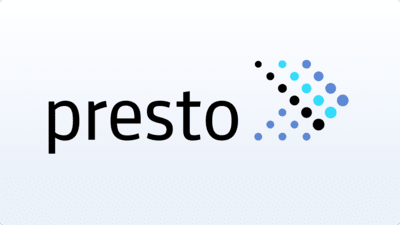

# Presto
## Introduction
Presto is an open-source distributed SQL query engine designed for running interactive analytic queries against data sources of all sizes. Originally developed by Facebook, Presto is now widely used in various industries for its ability to query data where it resides, including Hive, HDFS, relational databases, and cloud storage.

### Key Features
1. **Distributed Query Processing:**
- Executes queries across multiple nodes, providing high performance and scalability.
- Supports querying large datasets in a parallel and distributed manner.

2. **SQL Compatibility:**
- Provides full support for standard ANSI SQL, making it easy for users familiar with SQL to write queries.

3. **Data Source Integration:**
- Integrates with a wide range of data sources: HDFS, Hive, relational databases, NoSQL databases, and cloud storage systems.

4. **Performance Optimization:**
- Cost-based optimizer: Uses statistics to determine the most efficient way to execute queries.
- In-memory processing: Reduces latency by processing data in memory.

5. **Extensibility:**
- Connector architecture: Allows easy integration with new data sources by adding custom connectors.

6. **Fault Tolerance and Reliability:**
- Designed for high availability and fault tolerance, ensuring continuous query execution even in the event of node failures.

### Architecture
1. **Coordinator:**
- Manages the lifecycle of queries, including parsing, planning, and scheduling.
Coordinates with workers to execute distributed tasks.

2. **Workers:**
- Execute tasks assigned by the coordinator.
- Handle data processing, including reading from data sources, performing joins, aggregations, and other operations.

3. **Connectors:**
- Plugins that enable Presto to communicate with various data sources.
- Provide a unified interface for data access across different systems.

### Use Cases
1. **Interactive Analytics:**
- Enables real-time data analysis, providing quick insights from large datasets.

2. **Data Warehousing:**
- Acts as a query layer on top of existing data warehouses, allowing fast and efficient querying.

3. **Business Intelligence:**
- Powers BI tools by providing a high-performance query engine for reporting and analytics.

4. **Ad Hoc Queries:**
- Supports exploratory data analysis with the ability to run complex queries on diverse data sources.

### Advantages
1. **High Performance:** Optimized for fast query execution with low latency.

2. **Scalability:** Easily scales out to handle increasing data volumes and query complexity.

3. **Flexibility:** Supports a wide range of data sources and can query data where it resides.

4. **Ease of Use:** Standard SQL support makes it accessible to users with SQL knowledge.

5. **Extensibility:** Connector architecture allows integration with new data sources and systems.

Presto is a powerful and versatile SQL query engine designed for high-performance, distributed querying across diverse data sources. Its ability to handle large-scale data processing with low latency makes it ideal for interactive analytics, data warehousing, business intelligence, and ad hoc querying. With its extensibility and ease of use, Presto is a valuable tool for organizations seeking to derive insights from their data quickly and efficiently.

## Learning Resources
### Books
- [Learning and Operating Presto](https://www.oreilly.com/library/view/learning-and-operating/9781098141844/)
- [Presto: The Definitive Guide: SQL at Any Scale, on Any Storage, in Any Environment](https://books.google.de/books/about/Presto.html?id=hgJ_xgEACAAJ&redir_esc=y)

### Courses
- [What Is Presto | PrestoDB Explained | Presto Overview Video | Intellipaat](https://www.youtube.com/watch?v=nPhqnfy8DSE)
- [Presto 101: An Introduction to Open Source Presto](https://www.youtube.com/watch?v=rKy7ifPhwrA)
- [Presto: a Powerful SQL Query Engine for Big Data! | Hadoop Big Data Tutorial | Lecture 39](https://www.youtube.com/watch?v=QhgkbJJZoag)

### Miscellaneous
- [Fast and Reliable SQL Engine for Data Analytics and the Open Lakehouse](https://www.youtube.com/watch?v=QhgkbJJZoag)
- [Presto](https://github.com/prestodb/presto)
