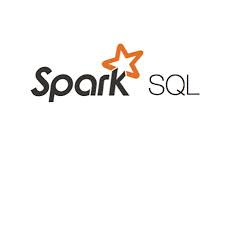

# SparkSQL

## Introduction

Spark SQL is a module of Apache Spark that integrates relational processing with Spark's functional programming API. It provides a powerful, scalable, and flexible query engine for big data applications, allowing users to execute SQL queries and perform data analysis on large datasets efficiently.

### Key Features
1. **SQL Compatibility:**
- Supports standard SQL and HiveQL, enabling users to write queries in a familiar language.
- Seamless integration with Spark's programming APIs in Scala, Java, Python, and R.

2. **Unified Data Access:**
- Accesses data stored in various formats, including JSON, Parquet, ORC, Avro, and CSV.
- Can query data from multiple sources like Hive tables, HDFS, NoSQL databases, and cloud storage.

3. **Performance Optimization:**
- Catalyst Optimizer: An advanced query optimizer that uses rule-based and cost-based techniques to optimize query execution plans.
- Tungsten Execution Engine: Enhances CPU and memory efficiency by using whole-stage code generation and in-memory computing.

4. **DataFrames and Datasets:**
- DataFrames: Distributed collections of data organized into named columns, similar to tables in a relational database.
- Datasets: Type-safe, object-oriented APIs that provide the benefits of RDDs (Resilient Distributed Datasets) with the optimization benefits of Spark SQL.

5. **Interoperability:**
- Easily integrates with other Spark components like Spark Streaming, MLlib (machine learning), and GraphX (graph processing).
- Can run on various cluster managers, including Hadoop YARN, Apache Mesos, and Kubernetes.

6. **Extensibility:**
- User-Defined Functions (UDFs): Allows users to create custom functions for specific operations.
- Support for custom data sources and connectors, enabling integration with various data systems.

### Architecture
1. **SQL Engine:**
- Parses and analyzes SQL queries.
- Generates optimized execution plans using the Catalyst Optimizer.

2. **Catalyst Optimizer:**
- Logical Plan: Initial representation of the parsed query.
- Optimized Logical Plan: Result of applying various optimization rules.
- Physical Plan: Execution plan detailing how the query will be executed on the cluster.

3. **Tungsten Execution Engine:**
- Whole-Stage Code Generation: Converts query plans into optimized bytecode for faster execution.
- In-Memory Computing: Reduces the need for disk I/O by keeping intermediate data in memory.

### Use Cases
1. **Data Warehousing:**
- Provides a scalable, high-performance platform for data warehousing and large-scale data analysis.

2. **Business Intelligence:**
- Powers BI tools by enabling fast, interactive SQL queries on large datasets.

3. **Real-Time Analytics:**
- Integrates with Spark Streaming to perform real-time data analysis and querying.

4. **ETL Processes:**
- Efficiently handles Extract, Transform, Load (ETL) processes, preparing data for analysis.

5. **Machine Learning:**
- Integrates with MLlib for running SQL queries on data used in machine learning workflows.

### Advantages
1. **Performance:** Optimized query execution with Catalyst and Tungsten engines ensures high performance.
2. **Scalability:** Easily scales to handle large datasets and complex queries across distributed clusters.
3. **Flexibility:** Supports a wide range of data sources, formats, and integration with other Spark components.
4. **Ease of Use:** Familiar SQL syntax and integration with various programming languages make it user-friendly.
5. **Extensibility:** Custom UDFs and data source connectors enhance its functionality.

Spark SQL is a powerful tool for querying and analyzing big data, providing high performance, scalability, and flexibility. Its integration with Apache Spark's ecosystem and support for standard SQL make it an essential component for data warehousing, business intelligence, real-time analytics, ETL processes, and machine learning. With its advanced optimization techniques and ease of use, Spark SQL enables organizations to derive valuable insights from their data efficiently.

## Learning Resources
### Books
- [Learning Spark, 2nd Edition by, Chapter 4. Spark SQL and DataFrames: Introduction to Built-in Data Sources](https://www.oreilly.com/library/view/learning-spark-2nd/9781492050032/)
- [Learning Spark SQL](https://www.packtpub.com/product/learning-spark-sql/9781785888359)
- [Spark SQL 2.x Fundamentals & Cookbook: More than 35 Exercises](https://www.amazon.com/Spark-SQL-2-x-Fundamentals-Cookbook/dp/1720019894)

### Courses
- [A Deep Dive into Query Execution Engine of Spark SQL - Maryann Xue](https://www.youtube.com/watch?v=ywPuZ_WrHT0)
- [spark sql engine in spark | Lec-8](https://www.youtube.com/watch?v=VDZ7erjooU0)
- [what is Spark SQL](https://www.youtube.com/watch?v=M40WQzjGePw)
- [Spark SQL Engine](https://www.youtube.com/watch?v=Ews3x3tchvo)

### Miscellaneous
- [Distributed SQL Engine](https://spark.apache.org/docs/3.5.1/sql-distributed-sql-engine.html)
- [Spark SQL](https://www.databricks.com/glossary/what-is-spark-sql)
- [Apache Spark as a Distributed SQL Engine](https://medium.com/@anicolaspp/apache-spark-as-a-distributed-sql-engine-4373e254e0f9)
- [Spark SQL, DataFrames and Datasets Guide](https://spark.apache.org/docs/2.2.1/sql-programming-guide.html)
