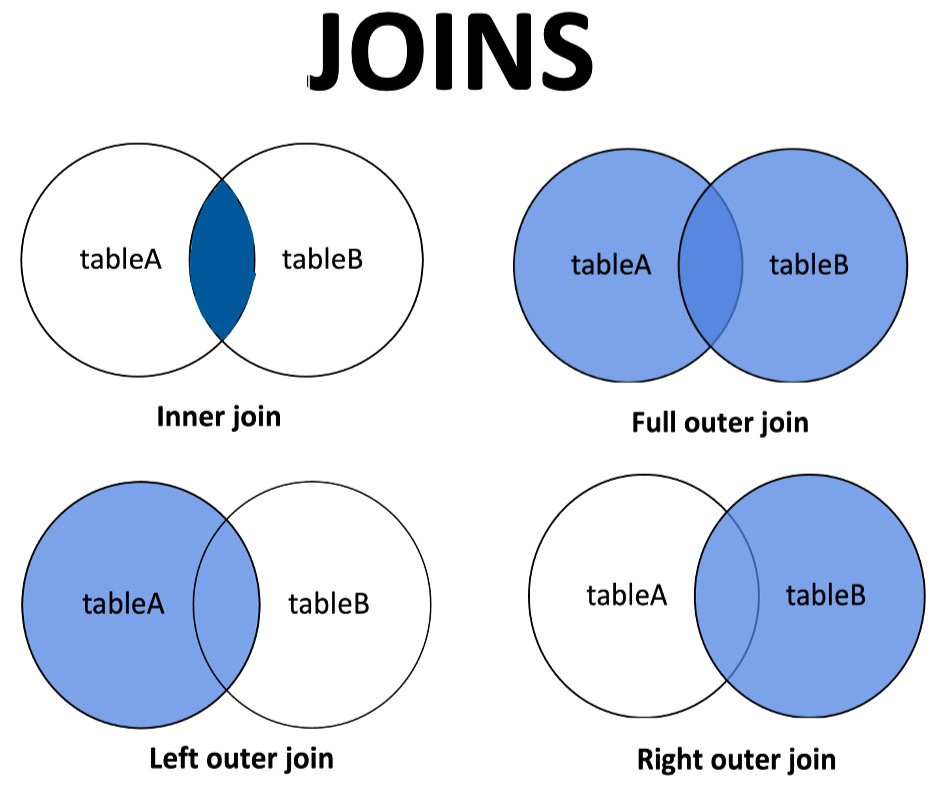

## Introduction

Structured Query Language (SQL) is the standard language used for managing and manipulating relational databases. It is an essential skill for data professionals, allowing them to create, read, update, and delete data in a database efficiently. SQL is powerful yet straightforward, making it accessible for beginners while still providing robust functionality for advanced users.

In this blog post, we'll cover some fundamental concepts in SQL, including CRUD operations, JOIN clauses, and the GROUP BY statement. Additionally, we'll highlight various resources to help you further your SQL knowledge, from books to online courses and tutorials.

## CRUD Operations

CRUD stands for Create, Read, Update, and Delete. These are the four basic functions of persistent storage:
- **Create:** `INSERT INTO` statements are used to add new records to a table.
- **Read:** `SELECT` statements allow you to retrieve data from one or more tables.
- **Update:** `UPDATE` statements modify existing records.
- **Delete:** `DELETE` statements remove records from a table.

Mastering CRUD operations is fundamental to interacting with any database.

## JOIN Clauses

JOINS are used to combine rows from two or more tables based on a related column between them. There are several types of joins:
- **INNER JOIN:** Returns records that have matching values in both tables.
- **LEFT JOIN:** Returns all records from the left table and the matched records from the right table, with NULLs in place where there is no match.
- **RIGHT JOIN:** Similar to LEFT JOIN, but returns all records from the right table.
- **FULL JOIN:** Returns records when there is a match in one of the tables. 

## GROUP BY Statement

The `GROUP BY` statement is used in conjunction with aggregate functions (like COUNT, SUM, AVG) to group the result-set by one or more columns. This is particularly useful for summarizing data and generating reports. For example, `GROUP BY` can help you find the total sales for each department in a company.

## Learning Resources

### Books

- [SQL in 10 Minutes, Sams Teach Yourself" by Ben Forta](https://www.amazon.com/SQL-Minutes-Sams-Teach-Yourself/dp/0672336073): A concise, hands-on guide for beginners.
- [Learning SQL" by Alan Beaulieu](https://www.amazon.com/Learning-SQL-Generate-Manipulate-Retrieve/dp/1492057614): An excellent resource for understanding the fundamentals of SQL.

### Courses

- [Khan Academy SQL Tutorial](https://www.khanacademy.org/computing/computer-programming/sql): A comprehensive, free course for beginners, covering basic to intermediate topics.
- [Codecademy SQL Course](https://www.codecademy.com/learn/learn-sql): An interactive course offering a hands-on approach to learning SQL.

### Miscellaneous

- [SQLZoo](https://www.sqlzoo.net/wiki/SQL_Tutorial): An interactive SQL tutorial with exercises to practice different SQL queries.
- [Mode Analytics SQL Tutorial](https://mode.com/sql-tutorial): A series of tutorials and practical exercises for learning SQL.
