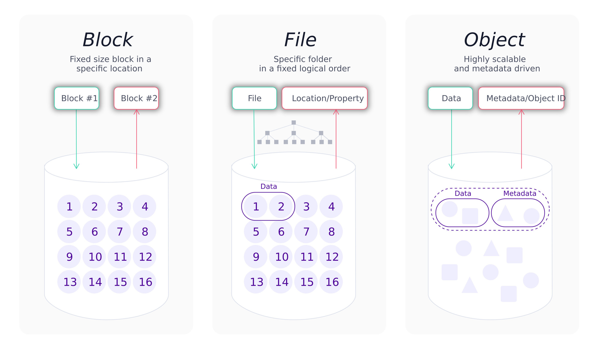

# Storages

## Introduction

Understanding the different types of storage solutions is essential for selecting the right technology for your needs. The three main types are block storage, object storage, and file storage. Each has its unique characteristics, use cases, and advantages.

### Block Storage

Block storage organizes data into fixed-size blocks, each with a unique identifier. These blocks are managed individually, allowing for efficient read/write operations and low-latency access. Block storage is commonly used in scenarios requiring high performance, such as databases, virtual machines, and enterprise applications. Its key characteristics include:

- **Performance**: High-speed data access makes it ideal for transactional databases and enterprise applications.
- **Flexibility**: Can be attached to different systems and resized as needed.
- **Scalability**: Suitable for environments that require scaling storage resources while maintaining performance.

### Object Storage

Object storage manages data as objects, each containing the data itself, metadata, and a unique identifier. This storage type is designed for scalability and is ideal for storing unstructured data such as multimedia files, backups, and logs. Object storage excels in environments requiring large-scale data storage with less frequent access patterns. Its key characteristics include:

- **Scalability**: Easily handles large volumes of data, making it suitable for cloud storage solutions.
- **Metadata**: Rich metadata support allows for better data management and retrieval.
- **Access**: Typically accessed via APIs, facilitating integration with various applications and services.
- **Cost** Efficiency: Often more cost-effective for storing vast amounts of data compared to block storage.

### File Storage

File storage organizes data into a hierarchical structure of files and directories, which is intuitive and user-friendly, especially for end-users. It is widely used for general-purpose storage needs, such as home directories and small-scale file sharing. However, file storage lacks the scalability and performance advantages offered by block and object storage. Its key characteristics include:

- **Usability**: Easy to use and manage for end-users.
- **Compatibility**: Works well with traditional file systems and applications.
- **Limitations**: Less efficient for large-scale or performance-critical applications, which is why it is not discussed in detail here.

Each type of storage—block, object, and file—serves different needs in the data management ecosystem. Block storage, with its high performance and low latency, is perfect for demanding applications like databases and virtual machines. Object storage offers unparalleled scalability and is ideal for managing unstructured data at a large scale. While file storage is intuitive and suitable for general-purpose needs, its limitations in scalability and performance make it less suitable for large-scale enterprise solutions, highlighting the importance of block and object storage in more demanding environments.

## Learning Resources

### Books
- [Designing Data-Intensive Applications](https://www.oreilly.com/library/view/designing-data-intensive-applications/9781491903063/)
- [Distributed systems: Principles and Paradigms](https://vowi.fsinf.at/images/b/bc/TU_Wien-Verteilte_Systeme_VO_%28G%C3%B6schka%29_-_Tannenbaum-distributed_systems_principles_and_paradigms_2nd_edition.pdf)
  
### Courses
- [AWS Storage: EBS vs. S3 vs. EFS](https://www.youtube.com/watch?v=_CN7KqC3y3s)
- [Data Storage Types: File, Block, & Object](https://www.youtube.com/watch?v=KhHr4chx_ZM)
- [Block vs Object vs File Storage | Cloud Storage Types Explained](https://www.youtube.com/watch?v=sswLpKeAoxs)
- [File vs. Object vs. Block Storage](https://www.youtube.com/watch?v=EqC2-lB5Xck)

### Miscellaneous
- [Distributed Storage Systems](https://www.geeksforgeeks.org/distributed-storage-systems/)
- [What is Distributed Storage? Types and Examples](https://hostkey.com/blog/53-what-is-distributed-storage/)