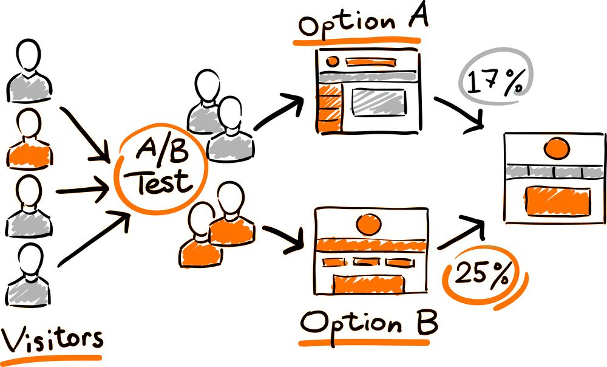

## A/B Testing

## Introduction

A/B testing, also known as split testing, is a method of comparing two versions of a webpage or app against each other to determine which one performs better. It's essentially an experiment where two or more variants of a page are shown to users at random, and statistical analysis is used to determine which variation performs better for a given conversion goal.

A/B testing allows individuals, teams, and companies to make careful changes to their user experiences while collecting data on the results. This allows them to construct hypotheses, and to learn better why certain elements of their experiences impact user behavior.

## Learning resources

### Books

- [Trustworthy Online Controlled Experiments: A Practical Guide to A/B Testing](https://www.amazon.com/Trustworthy-Online-Controlled-Experiments-Practical/dp/1108724264) by Ron Kohavi, Diane Tang, and Ya Xu. This book covers everything from the basics to advanced topics in A/B testing.

- [A/B Testing: The Most Powerful Way to Turn Clicks Into Customers](https://www.amazon.com/Testing-Most-Powerful-Clicks-Customers/dp/1118792416) by Dan Siroker and Pete Koomen. The authors share their experiences with A/B testing at Google and offer practical tips.

### Courses

- [A/B Testing by Google](https://www.coursera.org/projects/create-an-a-b-web-page-and-marketing-test-with-google-optimize) on Coursera. This course provides a deep dive into A/B testing with practical examples.

- [Conversion Optimization and A/B testing](https://www.udemy.com/course/ab-testing-and-experimentation-for-websites-and-marketing/?couponCode=LETSLEARNNOWPP) on Udemy. This course is great for beginners and covers the fundamentals of A/B testing.

### Miscellaneous

- [A/B Testing in Real Life: An Email Marketer's Journey through the Highs and Lows](https://www.youtube.com/watch?v=YsfC52kIleI) by Flint McGlaughlin. This video provides a practical walkthrough of an A/B test.

- [A/B Testing Tutorial: From Beginner to Pro in a Blog Post](https://moz.com/blog/seven-simple-tips-for-insightful-ab-testing) on the Moz Blog. This tutorial provides a step-by-step guide to conducting your first A/B test.

- [The Ultimate Guide to A/B Testing](https://www.smashingmagazine.com/2010/06/the-ultimate-guide-to-a-b-testing/) on Smashing Magazine. This article covers everything you need to know about A/B testing, from the basics to the nuances.
