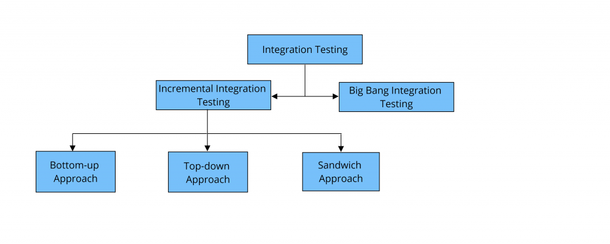

## Integration Testing

## Introduction

**Integration Testing** is a crucial phase in the software testing lifecycle where individual software modules are combined and tested as a group. It is conducted to evaluate the compliance of a system or component with specified functional requirements.

The main objective of integration testing is to expose faults in the interaction between integrated units. Test drivers and test stubs are used to assist in Integration Testing.

There are different strategies to carry out this testing such as **Big Bang**, **Top-Down**, and **Bottom-Up** testing. In **Big Bang** testing, most of the developed modules are coupled together to form a complete system or major part of the system and then used for integration testing. **Top-Down** and **Bottom-Up** are the incremental approaches to conduct integration testing.

## Learning Resources

### Books

- [Software Testing and Quality Assurance: Theory and Practice](https://www.amazon.com/Software-Testing-Quality-Assurance-Kshirasagar/dp/B011DANYCG) by Kshirasagar Naik and Priyadarshi Tripathy. This book provides a comprehensive treatment of the subject with a focus on practical learning.

### Courses

- [Software Testing Fundamentals](https://www.udemy.com/course/unit-testing-and-integration-testing/?couponCode=LETSLEARNNOWPP) on Udemy. This course provides a deep dive into software testing techniques, including integration testing.

### Miscellaneous

- [Integration Testing](https://www.geeksforgeeks.org/software-engineering-integration-testing/#:~:text=Integration%20testing%20is%20a%20software,modules%20of%20a%20software%20application.) article on GeeksforGeeks. This article provides a detailed explanation of integration testing with examples.
