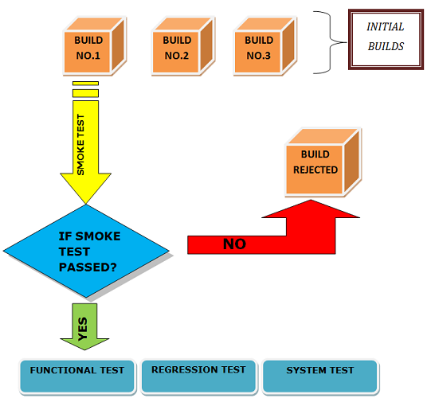

## Smoke Testing

## Introduction

**Smoke Testing**, also known as **Build Verification Testing**, is a type of software testing that comprises a non-exhaustive set of tests that aim at ensuring that the most important functions work. The result of this testing is used to decide if a build is stable enough to proceed with further testing.

The term 'smoke testing' originated in the hardware testing practice of turning on a new piece of hardware for the first time and considering it a success if it does not catch fire and smoke. In software industry, smoke testing is a shallow and wide approach whereby all areas of the application without getting into too deep, is tested.

A smoke test suite can be automated or a combination of manual and automated testing.

## Learning Resources

### Books

- [Software Testing: A Craftsman’s Approach](https://www.amazon.com/Software-Testing-Craftsmans-Approach-Fourth/dp/1466560681) by Paul C. Jorgensen. This book provides a comprehensive, pragmatic discussion on smoke testing.

### Courses

- [Smoke Testing](https://www.coursera.org/in/articles/what-is-smoke-testing)

### Miscellaneous

- [Smoke Testing on Guru99](https://www.guru99.com/smoke-testing.html) : This web page provides a comprehensive guide on smoke testing.
- [Smoke Testing on GeeksforGeeks](https://www.geeksforgeeks.org/smoke-testing-software-testing/) : This web page offers a detailed explanation of smoke testing and its importance in software development.